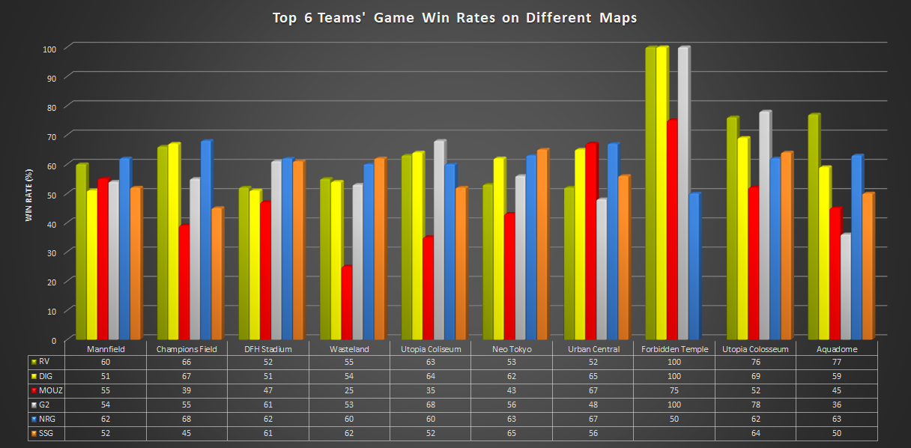

# Rocket League Esports

These scripts and database are used for scraping and collecting data about Rocket League Esports matches

All stats are from octane.gg using their api -> api.octane.gg

I am planning to then use this to create Machine Learning algorithims for predicting winners of future matches

# A graph showing the top 6 teams' game win rate for varying maps

